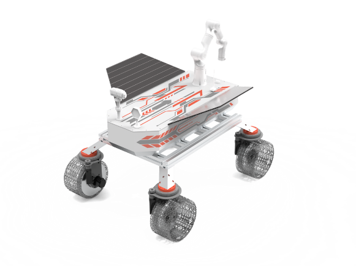

---
last_update:
  date: 09/01/2025
  author: Bingqi
  co-author: Isaac Hiew 
---

# LunarBot Hardware User Manual

## 1.0 Introduction

A lunar rover is a robotic vehicle designed to traverse the rocky surface of the Moon. The **LunarBot** is the fundamental unit of a lunar service robot cluster, developed by the **Distributed and Intelligent Space System Lab (DSSL)** at Tsinghua University.

This uncrewed robotic rover is designed for data collection and lunar terrain photography. Its robust design features a 4-wheeled independent steering and driving platform, a comprehensive multi-modal perception system, and a sophisticated 7-degree-of-freedom manipulator for interaction with the lunar environment.

*Figure 1: The LunarBot Robotic Rover Concept*

*Figure 2: The LunarBot Robotic Rover*

## 2.0 Geometric Specifications

| Dimension              | Value (mm)         | Notes                                   |
| :--------------------- | :----------------- | :-------------------------------------- |
| Length                 | ≈ 1303.05          | Without solar panels and manipulator    |
| Width                  | ≈ 997.09           | Without solar panels and manipulator    |
| Height                 | ≈ 782              | Without solar panels and manipulator    |
| Wheel Diameter (Φ)     | 260                | Without EVA foam                        |
| Wheel Width            | 168                |                                         |

## 3.0 Component Overview

### 3.1 Wheel Assemblies

The LunarBot features four identical, independently controlled wheel assemblies. Each wheel unit contains the following components:

*   **Driving Motor:** 200 Watts motor with an integrated encoder for precise velocity and position control.
*   **Steering Motor:** 100 Watts motor with an integrated encoder for accurate angular positioning.
*   **Origin Indicator Sensor:** An NPN switch for homing the steering mechanism.
*   **Limitation Indicator Sensor:** An NPN switch to prevent mechanical over-rotation.
*   **Gear Boxes:** Dedicated gear boxes for both the steering and driving motors to achieve optimal torque.
*   **Note:** The servos (motor controllers) for these motors are installed within the main chassis chamber.

### 3.2 Chassis Chamber

The sealed chassis chamber houses the core power and electronic systems:

*   **Power System:**
    *   High-Voltage Graphene Power Cell (Primary drive power)
    *   Low-Voltage Graphene Power Cell (Primary drive power)
*   **Control System:**
    *   **8 Servos:** Motor controllers for the 4 driving and 4 steering motors.
    *   **Computation Module:** The main onboard computer for processing sensor data and executing commands.
*   **Safety:**
    *   Circuit breakers for system protection.

### 3.3 Sensor Suite

The LunarBot is equipped with a multi-modal perception system for navigation and data collection:

*   **Livox-Mid360 LiDAR:** A 360° LiDAR sensor for high-resolution 3D mapping and obstacle detection in the surrounding environment.
*   **Intel RealSense D435i Camera:** A depth-sensing camera that provides RGB video, depth information, and inertial data for 3D vision, visual odometry, and terrain analysis.
*   **IMU (Inertial Measurement Unit):** Integrated within the RealSense camera, providing accelerometer and gyroscope data for tracking orientation and acceleration.

### 3.4 Manipulator System

For physical interaction and sample handling, the LunarBot is fitted with a robotic arm and gripper:

*   **Manipulator:** Realman RM-75, a 7-Degree-of-Freedom (7-DOF) robotic arm, providing human-like dexterity for complex tasks.
*   **End Effector:** Inspire Robots EG2-4C, a 2-finger gripper for grasping and manipulating objects.

## 4.0 Key Features

*   **All-Terrain Mobility:** Four-wheel independent steering and driving allows for omnidirectional movement and precise positioning on challenging lunar terrain.
*   **Advanced Perception:** Fusion of LiDAR, 3D vision, and IMU data enables robust autonomous navigation and mapping.
*   **Robotic Manipulation:** The 7-DOF arm and gripper extend the rover's capabilities beyond mobility to active interaction with the environment.
*   **Robust Power System:** Dual graphene power cells provide reliable and extended operational capacity.

---
**Manufacturer:** Distributed and Intelligent Space System Lab (DSSL), Tsinghua University.