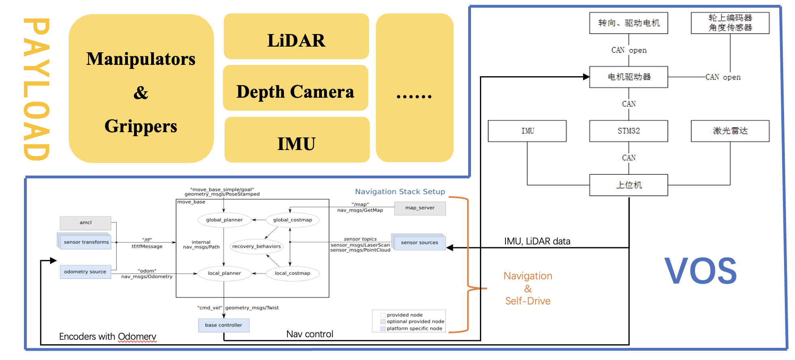

# Vos system

VOS stands for **V**ehicle **O**perating **S**ystem, which is designed for controlling wheeled robot chassis with various wheel configurations, primarily targeting Independent Steering Independent Driving (ISID) architectures. It is adaptable for wheeled robot systems with different numbers of wheels and wheel placements. The system is designed based on ROS2 and ros2 control, offering excellent compatibility and modularity for different types of actuators.



## System Introducton

The Vos system consists of two parts: the vos_controller, which is designed for ROS2 control, and the interface, which is designed for hardware interaction.

### [`vos_controller`](https://github.com/DsslRobot/vos_controller)

Vos controller is designed for ROS2 control. Currently it supports Independent Steering Independent Driving (ISID) architecture only. To prepare your robot for `vos_controller`, you should follow these steps:

1. In you workspace, `git clone git@github.com:DsslRobot/vos_controller.git`
2. Prepare a `vos_controller.yaml`
   ```yaml
   controller_manager:
     ros__parameters:
       update_rate: 100  # Hz

       joint_state_broadcaster:
         type: joint_state_broadcaster/JointStateBroadcaster

       vos_controller:
         type: vos_controller/VosController


   vos_controller:
     ros__parameters:
       steering_wheel_names:
         - chassis_to_front_left_steering_joint
         - chassis_to_front_right_steering_joint
         - chassis_to_rear_left_steering_joint
         - chassis_to_rear_right_steering_joint
       driving_wheel_names:
         - front_left_steering_to_wheel_joint
         - front_right_steering_to_wheel_joint
         - rear_left_steering_to_wheel_joint
         - rear_right_steering_to_wheel_joint

       wheel_x: [0.368545, -0.368545, 0.368545, -0.368545]
       wheel_y: [0.03998, 0.03998, 1.06803, -1.06803]
   ```
   Parameters:
   - `steering_wheel_names`: steering joint in the urdf
   - `driving_wheel_names`: driving joint in the urdf
   -  `wheel_x/wheel_y`: the x/y coordiniate of the wheel. The coordinate system is defined as the following: x axis is the front direction of the robot. z axis vertical to the ground and upward. xyz forms a right-hand coordinate system.
3. Launch controller in your launch file:
   ```py
    control_node = Node(
        package="controller_manager",
        executable="ros2_control_node",
        parameters=[{"robot_description": robot_description_content}, 
                    robot_control_config],
        output="screen",
    )
     vos_controller_spwaner = Node(
        package="controller_manager",
        executable="spawner",
        arguments=["vos_controller", "--controller-manager", "/controller_manager"],
    )
   ```
4. Publish `geometry_msgs/msg/TwistStamped` to topic `~/cmd_vel`. If you use namespace, change `~` to your namespace. By default we use `/cmd_vel`

**Attention**: Make sure you have the hardware interface for the joints in `steering_wheel_names` and `driving_wheel_names` in your config yaml. By default we need joints in `steering_wheel_names` have position interface and joints in `driving_wheel_names` have velocity interface


### Kinco System

We developed a hardware interface for kinco servo motor, which is widely used in AGV. The kinco system is built upon the `ros2_can_open` package. It communicates with the kinco servo motor via CAN.

To use `kinco_system` for your robot, you should follow the steps below:
1. Prepare your ros2 control urdf file:
   ```xml
   <?xml version="1.0"?>
    <robot xmlns:xacro="http://www.ros.org/wiki/xacro">
       <xacro:property name="steering_scale_command_to_real" value="52298.31429999681"/>
       <xacro:property name="steering_scale_real_to_state" value="8793.032"/>
       <xacro:property name="driving_scale_command_to_real" value="98374.32"/>
       <xacro:property name="driving_scale_real_to_state" value="2342.23"/>
       <xacro:property name="mirror" value="-1"/>
       <xacro:macro name="vos_bus_config" params="
         name
         bus_config
         master_config
         can_interface_name
         master_bin">
           <ros2_control name="${name}" type="system">
               <hardware>
                   <plugin>canopen_ros2_control/KincoSystem</plugin>
                   <param name="bus_config">${bus_config}</param>
                   <param name="master_config">${master_config}</param>
                   <param name="can_interface_name">${can_interface_name}</param>
                   <param name="master_bin">"${master_bin}"</param>
               </hardware>

               <joint name="chassis_to_front_left_steering_joint">
                   <param name="node_id">11</param>
                    <param name="type">steering</param>
                    <!-- 10000(encoder for one round) * 32.86(ratio on the motor) / 2pi -->
                    <param name = "scale_command_to_real"> ${steering_scale_command_to_real} </param> 

                    <param name = "scale_real_to_state"> 1 </param>
               </joint>


               <joint name="front_left_steering_to_wheel_joint">
                   <param name="node_id">1</param>
                   <param name="type">driving</param>
                   <!-- 4(raito) * 60 / 2*pi * 2730.666 (RPM -> DEC) / 0.065(wheel raidus)  -->
                   <param name = "scale_command_to_real"> ${mirror * driving_scale_command_to_real} </param> 
                    <param name = "scale_real_to_state"> 1 </param>
               </joint>
           </ros2_control>
       </xacro:macro>
    </robot>
   ```

   In this `.xacro` file, we define macro which set the hardware interface of your steering joint and driving joint. Each joint should be set with the following parameters:
   - `node_id`: the CAN id of the servo, which can be set in the servo controller
   - `type`: driving of steering, type of the joint.
   - `scale_command_to_real`: coefficient to convert m/s or rad to DEC(by multiplication).
   - `scale_real_to_state`: coefficient to convert DEV to m/s or rad(by multiplication).
2. Put kinco interface into your workspace: `git clone git@github.com:DsslRobot/kinco_interface.git`
3. Modify the `bus.yaml` in `kinco_interface` package. The only thing needed changing is the `node_id` and wheel name.
- `bus_config.yaml`: the configuration file for the CANopen node. Following configurations are needed:
    - **Node ID Assignment**: Configure unique CAN node IDs for each motor, **THIS MUST MATCH SERVO STATION ID SETTING IN KINCO SOFTWARE**
      - Steering motors: Typically 0x0B-0x0E (decimal 11-14) for LunarBOT and 0x01-0x06 (decimal 1-6) for universal platform.
      - Driving motors: Typically 0x01-0x04 (decimal 1-4) for LunarBOT and 0x0B-0x10 (decimal 11-16) for universal platform.
    
    **FOLLOWING INDEX AND PARAMS CAN BE FOUND IN KINCO SERVO DOCS**
    - **Motor Parameters**:
      - `index: 0x6081`: Set rotation speed (e.g., 400000 = 400 rpm)
      - `index: 0x6083`: Configure rotation acceleration (e.g., 200000 = 200 rpm/s²)
      - `index: 0x6060`: Set operation mode (1=position mode for steering, ±3=velocity mode for driving)
    - **PDO Mappings**:
      - TPDO1: Map status word (0x6041) and position/velocity feedback
      - RPDO1: Map control word (0x6040) and target position/velocity
    - **Network Settings**:
      - `baud_rate: 500` (500 kbps CAN bus speed) **THIS MUST MATCH USB_CAN DEVICE SETTINGs**, refer to [`docs/Hardware_Assembling_and_Debugging.md`](../LunarBot/Hardware%20Assembling%20and%20Debugging.md) for more details.
      - `sync_period: 10000` (10ms synchronization interval)
      - `master.node_id: 7` (CANopen master node ID)
    - **Motor Enable Sequence**:
      - Configure `index: 0x6040` with value `0x0000103f` for proper enable sequence

- `kinco.eds`: the EDS file for the CANopen node.